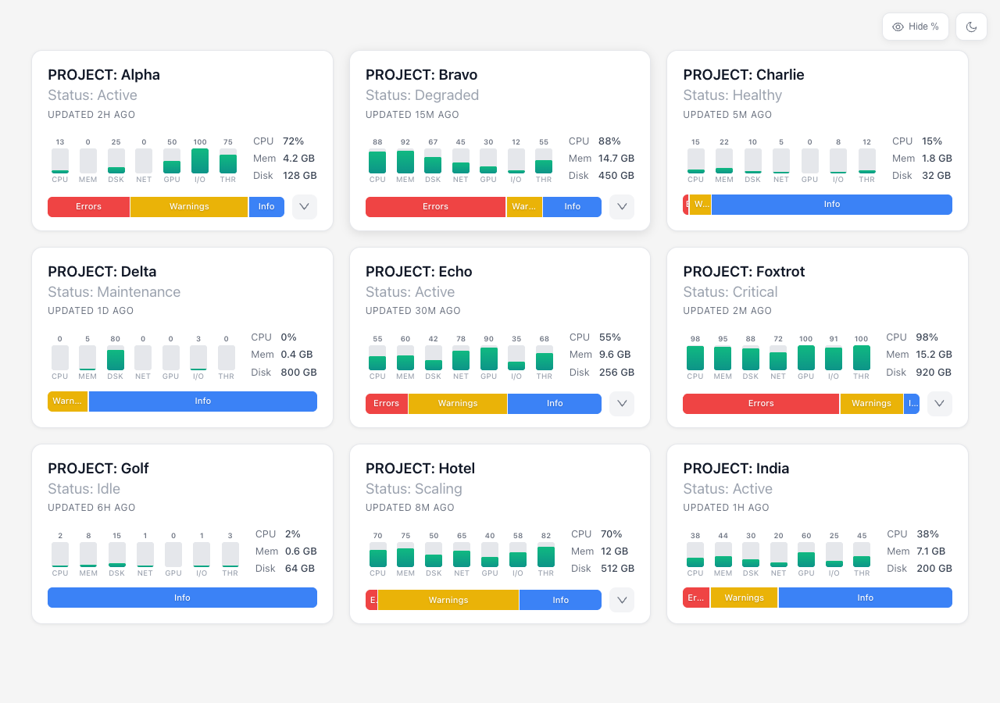
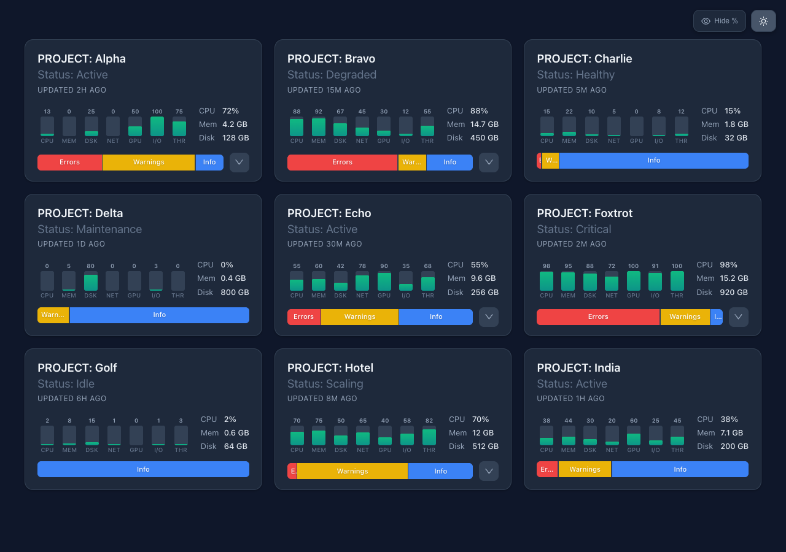
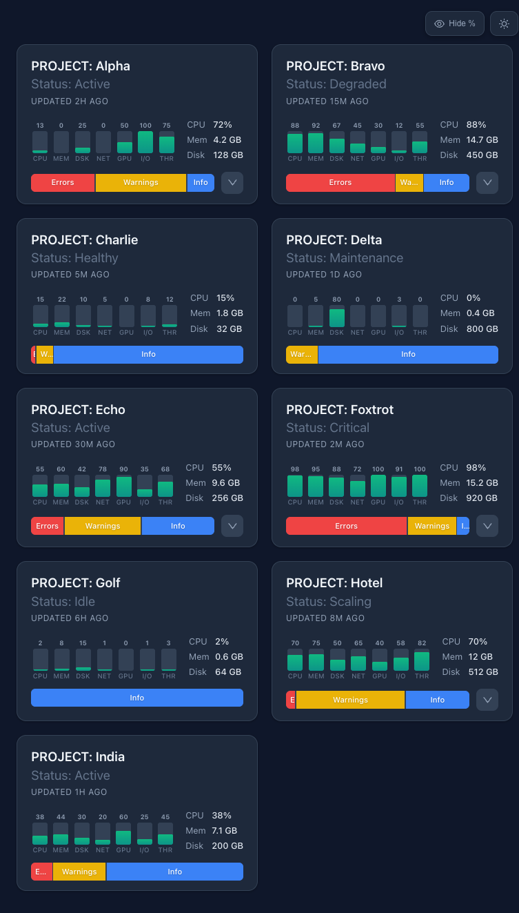
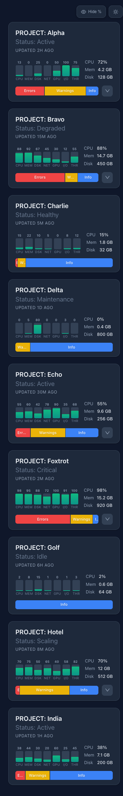

# Card UI Dashboard

A responsive status card dashboard built with React, TypeScript, and Vite. Displays project health metrics with resource usage gauges, stats, and segmented status bars.

## Screenshots

### Light Theme (Desktop)


### Dark Theme (Desktop)


### Responsive - Tablet (768px)


### Responsive - Mobile (375px)


## Features

- **9 Status Cards** in a responsive 3-column grid (3 cols > 2 cols > 1 col)
- **7 Resource Gauges** per card (CPU, MEM, DSK, NET, GPU, I/O, THR) with proportional fill bars and background tracks
- **Percentage Labels** on gauges with a global toggle to show/hide
- **Dark Theme** with a one-click toggle (sun/moon icon)
- **Segmented Status Bar** showing error/warning/info distribution
- **Expandable Cards** with additional detail panels
- **Tooltips** on gauges and segments for precise values

## Tech Stack

- **React 19** + **TypeScript 5.9**
- **Vite 8** for dev server and bundling
- **Ant Design 6** for icons, tooltips, and typography
- CSS custom properties for theming (no CSS-in-JS)

## Getting Started

### Prerequisites

- Node.js 18+
- npm 9+

### Install

```bash
npm install
```

### Development

```bash
npm run dev
```

Opens a local dev server at `http://localhost:5173` with hot module replacement.

### Build

```bash
npm run build
```

Outputs production files to `dist/`. TypeScript is type-checked before bundling.

### Preview Production Build

```bash
npm run preview
```

Serves the built `dist/` folder locally for testing.

### Lint

```bash
npm run lint
```

## Project Structure

```
src/
  App.tsx              # Grid layout, 9 card data sets, theme + percent toggles
  App.css              # Grid, toolbar, responsive breakpoints
  index.css            # CSS custom properties (light/dark themes)
  components/
    StatusCard.tsx      # StatusCard, UsageGauge, SegmentedBar components
    StatusCard.css      # Card, gauge, stats, segment styles
```
